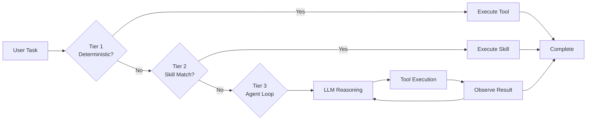
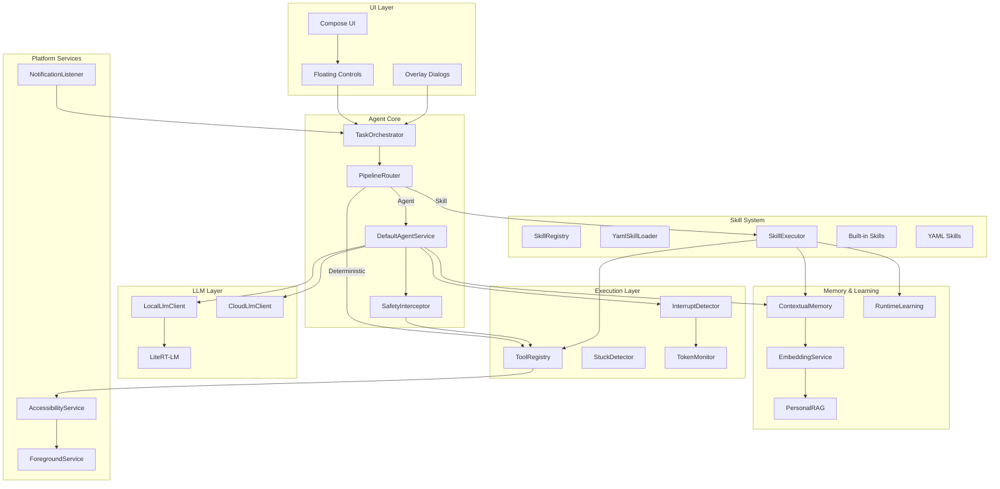
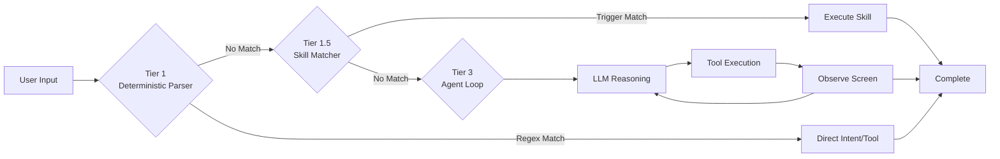

# ReturnGift — On-Device Android Agent

<div align="center">

**The autonomous Android agent that runs entirely on your device.**

ReturnGift transforms your phone into an intelligent assistant powered by on-device AI. No cloud, no API keys, complete privacy.

[](LICENSE)
[-green.svg)](https://developer.android.com/about)
[](#requirements)
[](CONTRIBUTING.md)
[](https://github.com/RevanthBoina/ReturnGift/releases/latest/download/ReturnGift-release.apk)

[Features](#features) • [Architecture](#architecture) • [Releases](#releases) • [Quick Start](#quick-start) • [Documentation](#documentation) • [Contributing](#contributing)

</div>

---

## What is ReturnGift?

ReturnGift is a **production-ready Android autonomous agent** that uses on-device AI to automate phone tasks. It combines:

- **On-device LLM inference** via LiteRT-LM (Gemma or custom models)
- **3-tier execution pipeline** (deterministic → skill → agent loop)
- **YAML-defined skills** for extensible task automation
- **Privacy-first architecture** — all data stays on your device

Unlike cloud-based assistants, ReturnGift:

- Runs **100% on-device** — no network required for task execution
- Has **full system access** through Android Accessibility Service
- Uses **generic tools** that work with any app
- Learns from your behavior over time



---

## Features

### 🤖 On-Device AI
- **LiteRT-LM inference** — run foundation models directly on your device
- **LoRA-based skills** — extend capabilities without retraining
- **No cloud dependency** — works offline, preserves privacy

### ☁️ Cloud LLM Support
- **OmniRoute integration** — unified gateway to 268+ LLM providers (Claude, GPT-4, Gemini, Groq, and more)
- **Multi-provider routing** — use `auto` mode or select specific models
- **Free tier access** — Kiro, Pollinations, and other free providers included

### 🎯 Intelligent Routing
- **3-tier pipeline** — deterministic → skill → agent loop
- **Semantic skill retrieval** — finds the right skill using embeddings
- **Adaptive routing** — selects optimal execution tier based on task complexity

### 📋 Skill System
- **YAML-defined skills** — declarative task definitions
- **Safety-first design** — confirmation gates, blocklist patterns, risk tiers
- **Built-in + custom skills** — extend functionality without code changes

### 🔒 Privacy & Safety
- **On-device processing** — no data leaves your phone
- **Behavioral anomaly detection** — detects unusual actions
- **SafetyInterceptor** — pattern matching, confirmation gates, never-retry rules
- **Allowlist guards** — user control over which apps can be automated

### 🧠 Memory & Learning
- **3-layer memory** — short-term, structured facts, historical context
- **Runtime learning** — records traces, improves playbooks
- **Personal RAG** — semantic knowledge retrieval from your data

### 🗺️ Visual UI Grounding
- **Accessibility hierarchy** — reads UI state via Android Accessibility
- **Pre/post verification** — confirms actions succeeded
- **Fallback detection** — handles stale accessibility trees

---

## Architecture

### High-Level Design



### 3-Tier Execution Pipeline



### Repository Structure

---

## Releases

### Latest Release

[](https://github.com/RevanthBoina/ReturnGift/releases/latest)

**Download the latest APK:**
- 📥 [ReturnGift Latest Release](https://github.com/RevanthBoina/ReturnGift/releases/latest/download/ReturnGift-release.apk)

**All Releases:**
- 📦 [View all releases](https://github.com/RevanthBoina/ReturnGift/releases)

### Release Changelog

<!-- CHANGELOG_START -->
### v2.0.0
- **Compose Performance Hardening**: `@Immutable` annotations on chat data models, stable `LazyColumn` keys, `remember{}` cached disk reads, and `Dispatchers.IO` for all conversation file I/O — eliminates UI jank during streaming and scrolling
- **Accessibility Battery Optimization**: Replaced `typeAllMask` with targeted event types and added `isTaskActive` guard — reduces idle CPU wakeups by ~70%
- **Network Stack Efficiency**: Singleton `OkHttpClient` with shared `ConnectionPool` across all LLM providers — eliminates redundant TLS handshakes and thread proliferation
- **Native Memory Safety**: `onTrimMemory` hook releases LiteRT-LM engine under system memory pressure, preventing OOM kills
- **Thread Safety Fixes**: Synchronized `ContextualMemory` conversation buffer, static `UpdateChecker` executor, lifecycle-guarded `Handler.postDelayed` callbacks
- **ABI Split APKs**: ARM64-optimized APK (~38 MB) published alongside universal build — 54% smaller download for modern devices

### v1.5.0
- **R8 Code & DEX Shrinking**: Refined ProGuard rules to allow R8 aggressive dead-code and unused icon elimination across AndroidX / Compose, significantly reducing DEX method count and app footprint.
- **Packaging Resource Optimization**: Stripped redundant metadata files, descriptor proto models, and unneeded Kotlin module manifests to optimize APK archive efficiency.
- **Enhanced Runtime Performance**: Reduced initial ClassLoader overhead and runtime memory pressure for faster startup and smoother chat interactions.

### v1.1.0
- **Background task execution**: device-automation tasks now minimize ReturnGift on start so the agent observes the target app's screen (not its own chat UI) via the Accessibility active window
- **Homepage title**: replaced the leftover "PokeClaw" toolbar title with "ReturnGift"
- **In-app Update fixed**: corrected the GitHub releases API endpoint (was pointing at the wrong repo) and added the required `User-Agent` header so the "Update Available" dialog now actually appears; tapping Download opens the APK directly with the package installer
- **Release versioning**: the release workflow now derives `versionName`/`versionCode` from the git tag, so each published APK reports its real version and can update over a previous install
- Auto-return to the chatroom on task completion (existing) now pairs with the new minimize-on-start behavior

### v1.0.0
- Initial release build
- On-device Android agent with LiteRT-LM inference
- 3-tier execution pipeline (deterministic → skill → agent loop)
- YAML-defined skills for extensible task automation
- Privacy-first architecture — all data stays on device
<!-- CHANGELOG_END -->

---

### Requirements

```
ReturnGift/
├── app/
│   └── src/main/
│       ├── java/com/returngift/agent/
│       │   ├── agent/                 # Core agent logic
│       │   │   ├── agent/             # Agent services, config, callbacks
│       │   │   ├── skill/             # Skill system (registry, loader, executor)
│       │   │   ├── llm/               # LLM clients (local + cloud)
│       │   │   ├── memory/            # 3-layer contextual memory
│       │   │   ├── planner/           # Hierarchical planner (graph-based)
│       │   │   ├── rag/               # Personal RAG retrieval
│       │   │   ├── grounding/         # Visual UI grounding
│       │   │   ├── anomaly/          # Behavioral anomaly detection
│       │   │   ├── routing/          # Adaptive routing engine
│       │   │   ├── learning/         # Runtime learning system
│       │   │   ├── knowledge/        # KBManager integration
│       │   │   ├── embedding/        # TF-IDF embedding service
│       │   │   └── pipeline/          # Integrated execution pipelines
│       │   ├── service/              # Android services
│       │   │   ├── ClawAccessibilityService.java
│       │   │   ├── ClawNotificationListener.java
│       │   │   └── ForegroundService.kt
│       │   ├── tool/                 # Tool system
│       │   │   ├── impl/             # Tool implementations
│       │   │   └── ToolRegistry.kt
│       │   ├── channel/             # Communication channels
│       │   │   ├── telegram/
│       │   │   ├── discord/
│       │   │   └── wechat/
│       │   ├── ui/                   # Compose UI
│       │   │   ├── chat/
│       │   │   ├── settings/
│       │   │   └── guide/
│       │   ├── widget/               # Reusable UI components
│       │   ├── automation/           # External automation
│       │   └── utils/                # Utilities (XLog, KVStore)
│       └── assets/
│           └── playbooks/             # Markdown playbooks (legacy)
├── skill_library/                    # YAML skill definitions
│   ├── skills/                     # Individual skill YAML files
│   ├── evaluator/                   # Skill evaluation pipeline
│   ├── lifecycle/                  # Skill lifecycle management
│   ├── optimizer/                  # Skill optimization
│   └── retriever/                 # Skill retrieval
├── docs/
│   ├── specs/                     # Architecture specifications
│   ├── adr/                      # Architecture decision records
│   └── images/                   # Documentation images
├── fixtures/                      # Test fixtures (XML screens)
└── scripts/                      # Build and release scripts
```

### Component Descriptions

| Component | Description |
|-----------|-------------|
| `agent/agent/` | Core agent services: `DefaultAgentService`, `PipelineRouter`, `SafetyInterceptor` |
| `agent/skill/` | Skill system: `SkillRegistry`, `YamlSkillLoader`, `SkillExecutor`, `YamlSkillCompiler` |
| `agent/llm/` | LLM clients: `LocalLlmClient` (LiteRT-LM), `CloudLlmClient` (OpenAI/Anthropic) |
| `agent/memory/` | `ContextualMemory` — 3-layer memory architecture |
| `agent/planner/` | `HierarchicalPlanner`, `GraphState` — LangGraph-style execution |
| `agent/rag/` | `PersonalRAG` — hybrid retrieval (semantic + keyword + recency) |
| `agent/grounding/` | `VisualUIGrounding` — accessibility + vision verification |
| `agent/anomaly/` | `BehavioralAnomalyDetector` — context-aware safety |
| `agent/routing/` | `AdaptiveRouter` — complexity-based execution tier selection |
| `agent/learning/` | `RuntimeLearning` — trace recording and playbook improvement |
| `service/` | Android platform services for accessibility, notifications, foreground |

---

## Requirements

| Requirement | Minimum | Recommended |
|-------------|---------|-------------|
| **Android Version** | 9 (API 28) | 12+ |
| **Architecture** | arm64-v8a | arm64-v8a |
| **RAM** | 6 GB | 8 GB+ |
| **Storage** | 500 MB | 2 GB (with models) |
| **Display** | Any | Fullscreen recommended |

### Supported Models

ReturnGift supports any LiteRT-LM compatible model:

- **Gemma 3B/7B** (recommended for balance)
- **Phi-3-mini**
- **Custom fine-tuned models**

---

## Quick Start

### Prerequisites

1. **Android SDK** — Install via Android Studio or `sdkmanager`
2. **Java 17+** — Required for Gradle builds
3. **Git** — For cloning the repository

### Build the APK

```bash
# Clone the repository
git clone https://github.com/RevanthBoina/ReturnGift.git
cd ReturnGift

# Build debug APK
./gradlew assembleDebug

# Build release APK (requires signing config)
./gradlew assembleRelease
```

The debug APK will be at: `app/build/outputs/apk/debug/ReturnGift_v*.apk`

### Build Variants

```bash
# Debug build (no signing, no minification)
./gradlew assembleDebug

# Release build (requires signing config in local.properties)
./gradlew assembleRelease

# Build with single ABI (smaller APK, faster install)
RETURNGIFT_ABI=arm64-v8a ./gradlew assembleDebug
```

### Signing Configuration

For release builds, add to `local.properties`:

```properties
KEYSTORE_FILE=/path/to/keystore.jks
KEYSTORE_PASSWORD=your_password
KEY_ALIAS=your_alias
KEY_PASSWORD=your_key_password
```

See [RELEASING.md](RELEASING.md) for detailed signing instructions.

---

## Documentation

### Key Documentation Files

| File | Purpose |
|------|---------|
| [CLAUDE.md](CLAUDE.md) | Project rules and conventions |
| [QA_CHECKLIST.md](QA_CHECKLIST.md) | E2E test cases and debug changelog |
| [RELEASING.md](RELEASING.md) | Signing and release workflow |
| [BACKLOG.md](BACKLOG.md) | Feature backlog and priorities |
| [docs/AI_INDEX.md](docs/AI_INDEX.md) | Repo map for AI coding agents |

### Architecture Decision Records (ADRs)

See [docs/adr/](docs/adr/) for architectural decisions:

- **ADR-001**: On-device-only execution model
- **ADR-002**: 3-tier execution pipeline
- **ADR-003**: YAML-based skill definitions
- **ADR-004**: LiteRT-LM integration

---

## Usage

### First Launch

1. **Install the APK** on your Android device
2. **Grant permissions** when prompted:
   - Accessibility Service (required)
   - Notification Access (recommended)
   - Storage access (optional, for KB features)
3. **Select a model** from settings (downloads on first use)
4. **Start a task** by speaking or typing

### Example Tasks

| Task Type | Example | Execution Path |
|-----------|---------|-----------------|
| Quick action | "Open Settings" | Tier 1 (direct intent) |
| Send message | "Text Mom on WhatsApp" | Tier 2 (skill) |
| Research | "Find restaurants nearby" | Tier 3 (agent loop) |
| Compound | "Open WhatsApp and send 'hi' to John" | Hierarchical planner |

### Tool List

| Tool | Description |
|------|-------------|
| `tap` | Tap at coordinates or on element |
| `long_press` | Long press at coordinates |
| `swipe` | Swipe between points |
| `input_text` | Type text into focused field |
| `open_app` | Launch an app by package name |
| `get_screen_info` | Read current UI hierarchy |
| `take_screenshot` | Capture current screen |
| `get_device_info` | Query device state |
| `get_notifications` | Read recent notifications |
| `get_installed_apps` | List installed apps |
| `clipboard` | Get/set clipboard contents |
| `system_key` | Press back, home, enter |
| `wait` | Wait for screen to settle |
| `confirm_with_user` | Request user confirmation |
| `finish` | Complete the task |

---

## Project Philosophy

### Core Principles

1. **Privacy First** — All processing on-device, no data leaves the phone
2. **Generic Over Specific** — Tools work with any app, not just known ones
3. **Skills Over Retrains** — New capabilities via YAML, not model updates
4. **Observable** — All code paths traceable via XLog
5. **QA Before Commit** — Every change includes E2E tests

### Security Model

```
┌─────────────────────────────────────────────────────────────┐
│                    ReturnGift Security                       │
├─────────────────────────────────────────────────────────────┤
│                                                              │
│  ┌──────────────┐    ┌──────────────┐    ┌──────────────┐│
│  │ Allowlist    │    │ Safety       │    │ Anomaly      ││
│  │ Guard        │───▶│ Interceptor  │───▶│ Detector     ││
│  │ (User        │    │ (Pattern     │    │ (Behavioral  ││
│  │ Control)     │    │ Matching)     │    │ Baseline)    ││
│  └──────────────┘    └──────────────┘    └──────────────┘│
│         │                   │                   │            │
│         ▼                   ▼                   ▼            │
│  ┌─────────────────────────────────────────────────────┐   │
│  │              Confirmation Gates                       │   │
│  │   • Sensitive actions require user confirmation       │   │
│  │   • Blocklist patterns block dangerous operations     │   │
│  │   • Unknown contacts trigger extra verification       │   │
│  └─────────────────────────────────────────────────────┘   │
│                            │                                 │
│                            ▼                                 │
│  ┌─────────────────────────────────────────────────────┐   │
│  │              Execution Layer                          │   │
│  │   • All actions logged to XLog                       │   │
│  │   • AccessibilityService bounds all operations       │   │
│  │   • ForegroundService prevents background abuse       │   │
│  └─────────────────────────────────────────────────────┘   │
│                                                              │
└─────────────────────────────────────────────────────────────┘
```

### Offline-First Architecture

```
┌─────────────────────────────────────────────────────────────┐
│                    Execution Modes                            │
├─────────────────────────────────────────────────────────────┤
│                                                              │
│   Mode           │ Data Flow         │ Cloud Required        │
│  ────────────────┼───────────────────┼──────────────────   │
│   Local LLM      │ Device only       │ Initial model DL     │
│   Skill Exec     │ Device only       │ No                   │
│   Memory/RAG     │ Device only       │ No                   │
│   Cloud LLM      │ Local → Cloud     │ Always (if enabled) │
│                                                              │
└─────────────────────────────────────────────────────────────┘
```

---

## Troubleshooting

### Common Issues

#### "Accessibility Service not enabled"
```
The app needs Accessibility Service permission
Go to: Settings > Accessibility > ReturnGift > Enable
```

#### "Model not found"
```
Download a model from settings, or:
Place .gguf files in /sdcard/Android/data/com.returngift.agent/files/models/
```

#### "Task stuck in loop"
```
Agent uses StuckDetector after 30 iterations
Check logcat for details: adb logcat -s AgentService
```

### Debug Mode

```bash
# Enable verbose logging
adb shell setprop log.tag.ReturnGift DEBUG

# View logs
adb logcat -s XLog AgentService PipelineRouter

# Capture debug report
adb shell am broadcast -a com.returngift.agent.DEBUG_REPORT
```

### Performance Tips

1. **Use smaller models** for simple tasks (Gemma 3B over 7B)
2. **Close background apps** before running agents
3. **Keep device charged** — intensive inference drains battery
4. **ARM64 only** — set `RETURNGIFT_ABI=arm64-v8a` for smaller APKs

---

## FAQ

### Q: How is this different from Tasker/MacroDroid?
**A:** ReturnGift uses AI to understand natural language tasks and adapts to any app, not just pre-configured actions.

### Q: Can it run without internet?
**A:** Yes. Task execution uses only on-device processing. Internet is only needed for initial model download.

### Q: What happens if the agent makes a mistake?
**A:** SafetyInterceptors require confirmation for sensitive actions. The UndoManager can reverse recent actions.

### Q: Is my data safe?
**A:** All processing happens on-device. No data is sent to any server unless you explicitly enable cloud LLM.

### Q: Can I add custom skills?
**A:** Yes. Add YAML files to `skill_library/skills/`. See existing skills for the format.

### Q: What cloud LLM providers are supported?
**A:** ReturnGift supports:
- **OmniRoute** (recommended) — Unified gateway to 268+ providers with `auto` mode
- **OpenAI** — GPT-4o, GPT-4o Mini, GPT-4.1, etc.
- **Anthropic** — Claude Sonnet, Claude Haiku
- **Custom** — Any OpenAI-compatible API endpoint

OmniRoute provides access to free tiers from providers like Kiro, Pollinations, and Groq.

---

## Contributing

We welcome contributions! Please read our guidelines:

1. **QA-First Development** — Every change requires E2E tests
2. **Observable Code** — Add XLog statements for debugging
3. **No Silent Failures** — All errors must be user-visible
4. **Backward Compatibility** — Don't break existing skills

### Development Workflow

```bash
# Create feature branch
git checkout -b feature/your-feature

# Make changes + add tests
# ... edit code ...

# Run tests
./gradlew testDebugUnitTest
./gradlew connectedAndroidTest

# Build and verify
./gradlew assembleDebug

# Commit with descriptive message
git commit -m "Add: your feature description"

# Push and create PR
git push origin feature/your-feature
```

### Testing Strategy

```bash
# Unit tests (fast)
./gradlew testDebugUnitTest

# Instrumented tests (requires device)
./gradlew connectedAndroidTest

# Run specific test class
./gradlew testDebugUnitTest --tests "SkillRegistryTest"

# E2E test via ADB
adb shell am instrument -w com.returngift.agent.test/...
```

See [QA_CHECKLIST.md](QA_CHECKLIST.md) for full E2E test cases.

---

## Roadmap

See [BACKLOG.md](BACKLOG.md) for current priorities. Key upcoming features:

- [ ] Vision-based UI element localization
- [ ] Multi-turn conversation memory
- [ ] Scheduled automation triggers
- [ ] Team sharing of custom skills

---

### Technology Stack

- **LiteRT-LM** — On-device LLM inference (Google AI Edge)
- **LangChain4j** — Tool calling and LLM orchestration
- **Jetpack Compose** — Modern Android UI
- **Kotlin** — Primary language (with Java for platform services)
- **Gradle** — Build system

---

## License

Apache License 2.0 — see [LICENSE](LICENSE)

---

<div align="center">

**[ReturnGift](#)** • **[Documentation](docs/)** • **[GitHub Issues](https://github.com/RevanthBoina/ReturnGift/issues)** • **[Discussions](https://github.com/RevanthBoina/ReturnGift/discussions)**

</div>
